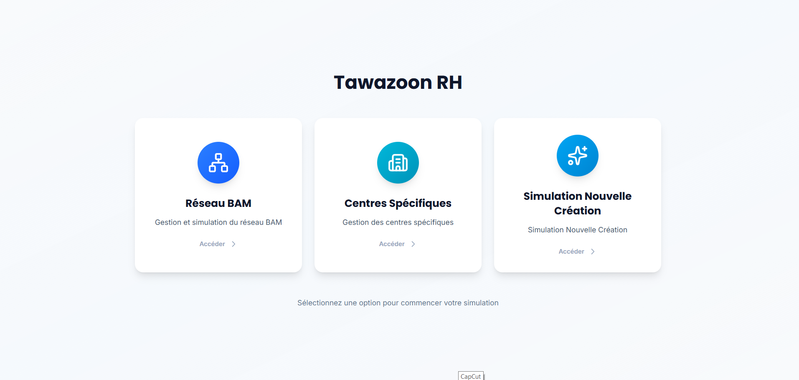
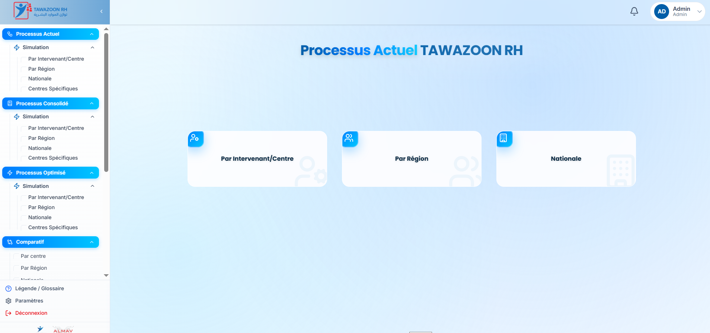
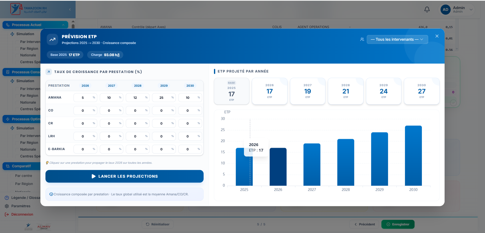
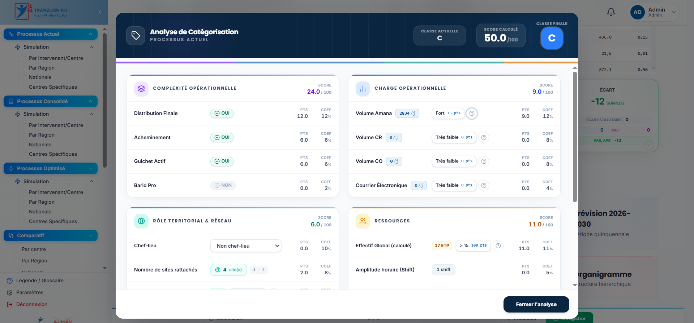
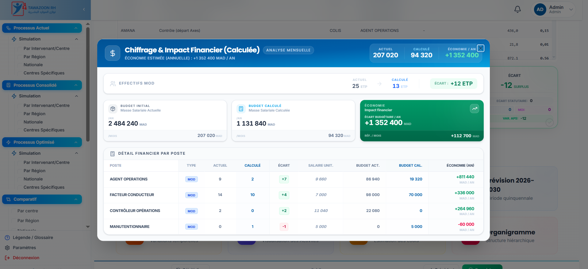
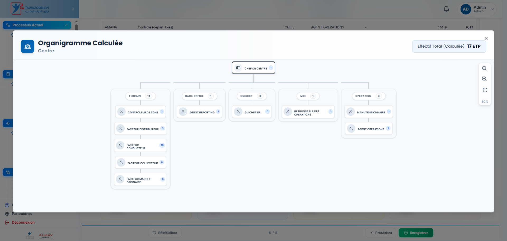
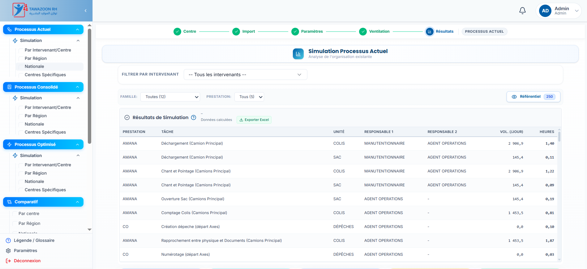
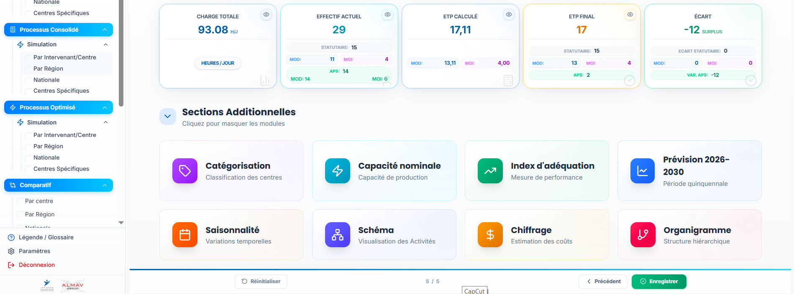
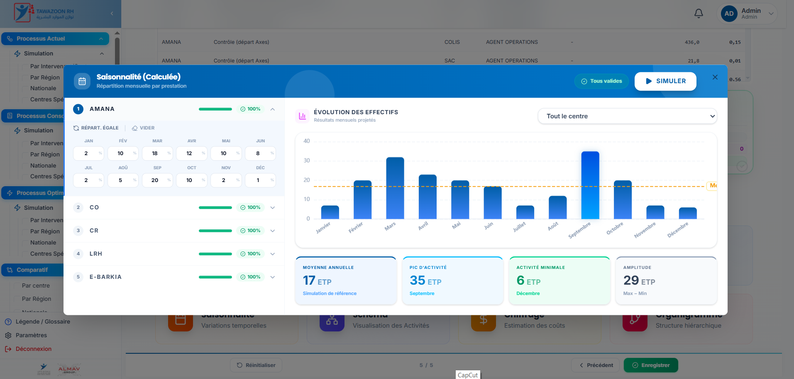

# Hi 👋 I'm Asmae  
💻 Full Stack Developer | React • FastAPI • SQL Server  
🚀 Building enterprise systems (HR • Logistics • ERP integrations)
🚀 3+ years of experience building scalable enterprise applications  
📍 Based in Morocco  

---

## 👩‍💻 About Me

Full Stack Developer with 3+ years of experience in building web applications and integrating enterprise systems.

I specialize in:
- Frontend development with React
- Backend development with Python / FastAPI
- Designing scalable systems and complex business logic

💡 I have worked on real-world projects in:
- HR systems (FTE simulation, productivity analysis)
- Logistics & fleet management systems
- ERP & WMS integrations (EDI)

---

## 🛠 Tech Stack

### Frontend
- React, JavaScript (ES6+)
- Tailwind CSS, Bootstrap

### Backend
- Python, FastAPI
- REST APIs

### Database
- SQL Server (Advanced)
- MySQL
- MongoDB

### Other
- SQLAlchemy
- Data processing & performance optimization
- Agile environment

---

## 📌 Featured Projects

### 🧠 HR Simulation System (SIRH)
- Developed a full HR simulation engine (FTE, productivity, workforce planning)
- Built with React + FastAPI + SQL Server
- Implemented complex business rules and data processing

---

### 🚚 Fleet Management System
- Designed workflow system for resource allocation (vehicles & drivers)
- Built scalable backend APIs with FastAPI
- Integrated business logic for operations management

---

### 🔗 ERP ↔ WMS Integration (EDI)
- Implemented EDI integrations between ERP and WMS systems
- Processed XML/JSON data flows
- Ensured system synchronization and data consistency

---

## 💪 Strengths

- Problem solving & system design
- SQL performance optimization
- Business analysis (Logistics, HR, ERP)
- Communication with technical & business teams

---

## 📫 Contact

- 📧 Email: asmaeelhamouche20@gmail.com  
- 💼 LinkedIn: https://www.linkedin.com/in/asmae-el-hammouch-293687191/  

---
## 📸 Screenshots
HR Simulator
## 📸 Screenshots

### 🏠 Accueil

### 📋 Menu

### 🔘 Menu Active

### 📊 Prévision

### 🗂 Catégorie

### 💰 Chiffrage

### 🧩 Organigramme

### 📈 Résultat 1

### 📈 Résultat 2

### 📅 Saison

⭐ Always building real-world solutions and improving system performance
